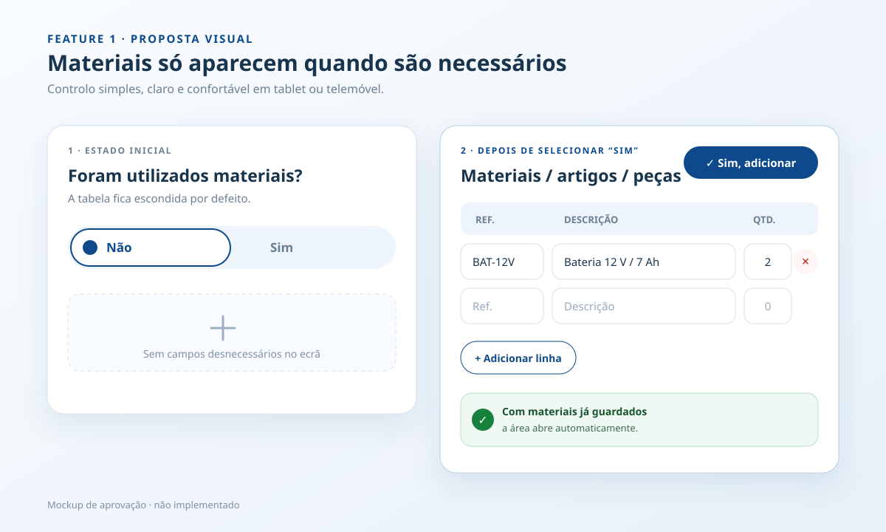
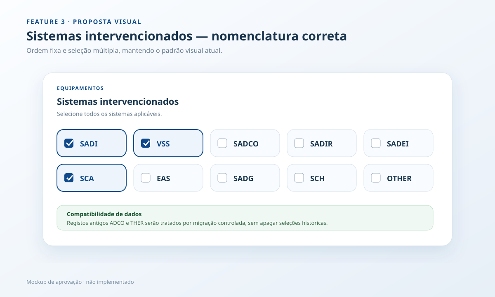
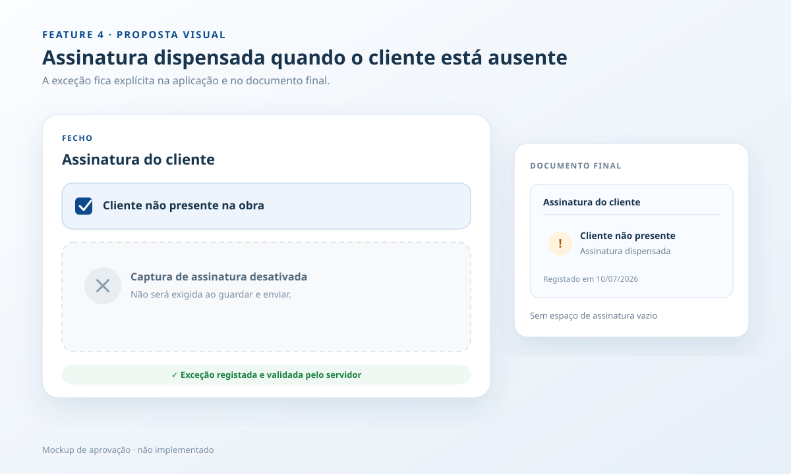
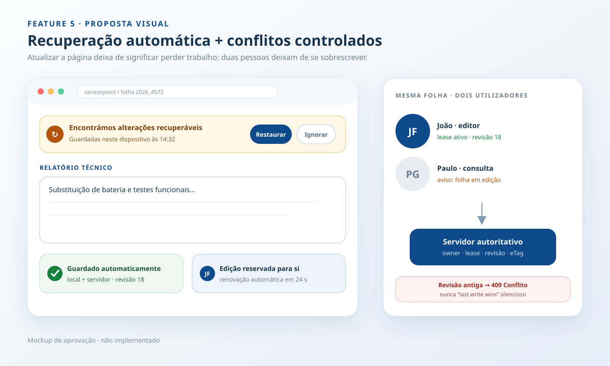

# Relatório de proposta — melhorias à aplicação

Data da auditoria: 10 de julho de 2026
Data da implementação e validação final: 14 de julho de 2026

Estado: **features 1, 2, 3, 4 e 5 implementadas e validadas**.

## Requisito transversal — integridade gráfica

Todas as features devem reutilizar a linguagem visual existente: cores e tokens Sensorpoint, tipografia, espaçamentos, raios, sombras, cards, botões, chips, tabelas, confirmações e toasts. Uma feature funcional com desalinhamentos, overflow ou quebra responsiva não é considerada concluída.

A validação inclui desktop, tablet e telemóvel, estados vazio/preenchido/erro/desativado, idiomas PT/EN e o documento final quando afetado.

## Resumo da auditoria

A aplicação já tem uma base coerente para formulários, rascunhos e autenticação Microsoft, mas os cinco pedidos tocam em quatro camadas: interface, schema do documento, validação no servidor e persistência em SharePoint/Graph.

O comportamento atual relevante é este:

- A secção de materiais está sempre visível e é sempre criada com uma linha vazia.
- O total de horas é calculado no browser, está `readonly` e é recalculado sempre que o início ou o fim muda.
- Os sistemas atuais incluem `ADCO` e `THER`; a lista pedida exige `SADCO` e `OTHER`, além de uma ordem diferente.
- O servidor exige sempre `Assinatura Cliente` ao finalizar.
- “Atualizar”, “Recarregar”, mudar de folha ou atualizar o browser pode descartar alterações que ainda não foram guardadas.
- O estado “Em execução” deriva do nome da pasta/ficheiro. Não existe propriedade de edição, lease, revisão de documento nem bloqueio otimista. No Graph, os uploads substituem o conteúdo remoto sem um `If-Match`/eTag, pelo que duas gravações podem produzir “última gravação ganha”.

## Feature 1 — revelar materiais apenas quando selecionados

### Alteração proposta

Substituir a secção sempre aberta por uma pergunta compacta: **“Foram utilizados materiais?”**, apresentada como controlo segmentado `Não | Sim`.

- Estado inicial: `Não`; a tabela fica escondida.
- Ao selecionar `Sim`: a área expande com animação curta e foco na primeira linha.
- Se a folha já tiver materiais guardados: `Sim` fica selecionado e a área abre automaticamente.
- Ao mudar de `Sim` para `Não` com linhas preenchidas: pedir confirmação antes de apagar os materiais.
- Manter “Adicionar linha” apenas dentro da área expandida.

### Implementação prevista

- `field_app.html`: introduzir o controlo e associar a tabela a uma região acessível (`aria-expanded`/`aria-controls`).
- `document-editor.css`: estados compacto/expandido, transição e comportamento responsivo.
- `document-editor.js`: derivar o estado de dados existentes, abrir/fechar, gerir foco e confirmar remoção.
- Schema: guardar um booleano `materials_used` para preservar a intenção mesmo quando ainda não há linhas preenchidas; dados antigos com materiais implicam automaticamente `true`.
- Documento final: sem alteração estrutural; continuará a apresentar “Sem materiais registados” quando aplicável.

### Critérios de aceitação

- Uma folha sem materiais abre com a tabela invisível.
- Selecionar `Sim` revela a tabela sem recarregar a página.
- Materiais existentes nunca ficam escondidos por erro.
- Desativar a opção não apaga linhas sem confirmação.
- O estado é preservado num rascunho e funciona em desktop, tablet e telemóvel.

Risco/complexidade: **médio-baixo**.

## Feature 2 — total de horas editável pelo técnico

### Alteração proposta

Manter o cálculo automático entre início e fim, mas transformar **Total efetivo** num campo editável. O técnico pode, por exemplo, corrigir `09:00–18:00` de `9 h` para `8 h` devido ao almoço.

- O primeiro preenchimento de início/fim calcula o total.
- Uma edição manual marca o valor como **Ajustado** e mostra discretamente o cálculo original.
- Depois de um ajuste manual, alterar início/fim não sobrescreve silenciosamente o valor; o utilizador pode escolher **“Usar cálculo”**.
- Aceitar formatos naturais: `8`, `8:00`, `8 h` e `7 h 30 min`, normalizando para uma apresentação consistente.
- O total manual continua a alimentar os campos Excel `T.Total trabalho`, `T.Total h` e `T.Total m`.

### Implementação prevista

- Remover `readonly` do total no template e melhorar o rótulo para “Total efetivo”.
- No JavaScript, separar valor calculado de valor confirmado e adicionar validação/normalização.
- No schema de cada técnico, acrescentar `total_hours_overridden` para preservar a decisão depois de fechar e reabrir a folha.
- Compatibilidade: documentos antigos inferem “manual” apenas quando o total guardado difere do cálculo início–fim.
- Atualizar a pré-visualização/documento final e os testes de conversão para Excel.

### Critérios de aceitação

- Sem intervenção manual, o total acompanha início/fim.
- O técnico consegue gravar `8 h` para um intervalo de `9 h`.
- O valor ajustado sobrevive a rascunho, refresh e reabertura.
- Valores inválidos são rejeitados com mensagem junto ao campo.
- Turnos que passam a meia-noite continuam a funcionar.

Risco/complexidade: **médio**.

## Feature 3 — corrigir sistemas intervencionados

### Lista final e ordem

`SADI · VSS · SADCO · SADIR · SADEI · SCA · EAS · SADG · SCH · OTHER`

### Implementação prevista

- Substituir a definição atual pela lista e ordem indicadas.
- Corrigir `ADCO` para `SADCO` e `THER` para `OTHER`.
- Preservar o mapeamento já existente `VSS → CCTV` no Excel.
- Sistemas sem coluna própria no Excel continuam guardados no JSON do documento e resumidos nas Observações, como acontece atualmente.
- Criar migração de leitura para documentos antigos: `adco → sadco` e `ther → other`. A gravação seguinte usa apenas as novas chaves.
- Atualizar testes do schema e do documento final para impedir regressões na nomenclatura e na ordem.

### Critérios de aceitação

- Só aparecem as dez opções aprovadas, na ordem aprovada.
- Seleções antigas não desaparecem ao abrir um rascunho.
- A pré-visualização e o Excel refletem as seleções corretas.
- Não ficam referências visíveis a `ADCO` ou `THER` depois da migração.

Risco/complexidade: **baixo**, com atenção à migração histórica.

## Feature 4 — cliente não presente, sem assinatura obrigatória

### Alteração proposta

Adicionar a checkbox **“Cliente não presente na obra”** acima da assinatura.

- Desmarcada: comportamento atual; assinatura obrigatória ao finalizar.
- Marcada: a captura fica desativada/recolhida e a assinatura deixa de ser obrigatória.
- Se já existir assinatura e a checkbox for marcada, pedir confirmação antes de a limpar.
- O documento final mostra **“Cliente não presente na obra — assinatura dispensada”**; não apresenta apenas um espaço de assinatura vazio.
- A regra será validada no servidor, não apenas no browser.

### Implementação prevista

- Adicionar `client_not_present: bool` ao schema/JSON do documento.
- Atualizar interface, traduções PT/EN, canvas e estado acessível.
- Alterar a validação de finalização: exigir assinatura apenas quando `client_not_present == false`.
- Incluir a justificação no HTML final e nas Observações exportadas para Excel, para rastreabilidade.
- Atualizar testes de rascunho, finalização, assinatura existente e geração do documento.

### Critérios de aceitação

- Sem checkbox, não é possível finalizar sem assinatura.
- Com checkbox, é possível finalizar sem assinatura.
- Não é possível enviar um payload manipulado sem assinatura e sem a exceção explícita.
- O documento final regista claramente a ausência do cliente.
- Reabrir um rascunho mantém a checkbox e o estado da assinatura.

Risco/complexidade: **médio**.

## Feature 5 — evitar perda de dados e suportar vários utilizadores

Esta feature deve separar três problemas que hoje parecem um só: cache de recursos da PWA, recuperação de alterações do formulário e concorrência entre utilizadores.

### Estado da implementação

Implementação concluída com:

- recuperação IndexedDB por utilizador e documento, autosave JSON e indicadores de estado;
- leases renováveis por aba, revisões, conflitos HTTP `409` e operações idempotentes;
- escritas locais atómicas e atualizações Graph condicionais por eTag/`If-Match`;
- cache PWA limitada a assets versionados, fallback offline e exclusão das rotas `/api/`;
- validação automática integral (`48 passed`) e verificação local em browser de refresh/restore, duas abas, indisponibilidade e retoma de sincronização.

Nota de ambiente: a verificação live, apenas de leitura, do backend configurado devolveu `404 itemNotFound` para `Aplicação/Activas`. A lógica Graph condicional está coberta por testes, mas o caminho/drive/permissões do SharePoint devem ser corrigidos antes da ativação em produção.

### 5A. Recuperação no dispositivo

- Detetar estado “alterado” em todos os campos, tabelas e assinatura.
- Guardar uma cópia de recuperação em **IndexedDB**, com debounce, por utilizador + folha + revisão. IndexedDB é preferível a `localStorage` porque a assinatura pode ser grande.
- Depois de refresh, crash ou fecho involuntário, mostrar: **“Encontrámos alterações recuperáveis”**, com `Restaurar` e `Ignorar`.
- Proteger “Atualizar”, “Recarregar”, mudar de folha, logout e navegação quando existem alterações ainda não sincronizadas.
- Limpar a cópia local depois de uma gravação confirmada, finalização ou descarte explícito; expirar cópias antigas.

### 5B. Autosave no servidor

- Criar autosave leve do JSON do documento, sem reescrever e reenviar o Excel a cada tecla.
- Indicador de estado: `A guardar…`, `Guardado às HH:MM`, `Sem ligação — guardado neste dispositivo`.
- A gravação explícita de rascunho continua a consolidar JSON, assinatura e Excel.
- Operações recebem uma chave de idempotência para que duplo clique/retry não duplique rascunhos nem finalize duas vezes.

### 5C. Concorrência multiutilizador

- Usar a identidade autenticada da sessão como proprietário; não confiar no nome de técnico enviado pelo browser.
- Ao começar a editar, criar uma **reserva/lease** com proprietário, timestamp e expiração; renovar por heartbeat.
- Outro utilizador vê a folha em modo de consulta com “Em edição por …”. Só pode assumir edição depois de a reserva expirar ou por ação autorizada.
- Associar o rascunho à folha original por um ID estável. Isto impede duas cópias independentes da mesma folha, situação possível com a lógica atual baseada apenas no nome.
- Cada leitura devolve `revision` e `eTag`; cada autosave/gravação envia `base_revision` e usa `If-Match` no Graph.
- Se a revisão mudou, devolver HTTP `409 Conflict` e apresentar opções seguras; nunca sobrescrever silenciosamente.
- Escritas locais devem ser atómicas; em Graph, guardar metadados de item/eTag e usar atualização condicional.

### 5D. Cache da PWA

- Cachear apenas recursos estáticos versionados (CSS, JS, imagens e manifesto).
- Não colocar respostas autenticadas de `/api/` nem conteúdo de folhas na Cache Storage.
- Atualizar a estratégia do service worker para evitar servir JavaScript antigo depois de um deploy e fornecer um fallback offline real.
- Isolar a recuperação IndexedDB por utilizador e limpá-la no logout, importante em dispositivos partilhados.

### Critérios de aceitação

- Escrever, atualizar o browser e restaurar todos os campos, linhas e assinatura.
- Uma falha de rede mantém uma cópia local e sincroniza depois sem duplicar ações.
- Mudar de folha com alterações pendentes exige decisão do utilizador.
- Dois utilizadores podem editar folhas diferentes sem interferência.
- Dois utilizadores na mesma folha não conseguem sobrescrever-se.
- Uma lease abandonada expira e a folha pode ser retomada.
- Uma gravação com revisão antiga devolve conflito e mantém ambas as versões disponíveis para decisão.
- A finalização é idempotente: retry/duplo clique produz um único arquivo.

### Testes obrigatórios

- Refresh, fecho de aba, crash, expiração de sessão e logout.
- Offline → edição → online; falha durante autosave e durante finalização.
- Dois browsers/utilizadores na mesma folha e em folhas diferentes.
- Duas abas do mesmo utilizador.
- Lease expirada, revisão obsoleta e finalização concorrente.
- Deploy com service worker antigo e atualização para assets novos.

Complexidade: **alta**. A implementação foi separada nas camadas 5A/5D, 5B e 5C e coberta por testes de estado, web/API, Graph condicional e PWA.

## Ficheiros/áreas afetados pela implementação

- UI: `src/web/templates/field_app.html`
- Comportamento do editor: `src/web/static/js/document-editor.js`
- Estilos: `src/web/static/css/document-editor.css`, `editing-state.css` e, pontualmente, `field-app.css`
- Schema e mapeamento Excel: `src/document_schema.py`
- Validação/endpoints: `src/web/application.py`
- Documento final: `src/web/templates/service_document.html` e respetivo CSS
- Persistência Graph: `src/services/graph_storage_service.py`
- Serviço de edição/revisões: `src/services/editing_state_service.py`
- Service worker/PWA: `src/web/static/service-worker.js` e `pwa.js`
- Testes: schema, web/API, arquivo, Graph/conflitos e JavaScript quando aplicável

## Sequência recomendada

Para reduzir migrações repetidas: **3 → 1 → 2 → 4 → 5**. A feature 5 deve ser concluída antes da abertura da aplicação a vários utilizadores, mesmo que seja aprovada por último.

As cinco features foram aprovadas, implementadas e verificadas. A aplicação local de QA ficou disponível em ambiente isolado, sem alterar os ficheiros Excel reais do utilizador.
